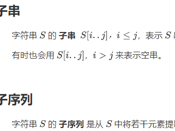

# 字符串基础

### 字符串

一个 **字符串**  $S$ 是将 $n$ 个字符顺次排列形成的序列，$n$ 称为 $S$ 的长度，表示为 $|S|$。$S$ 的第 $i$ 个字符表示为 $S[i]$。（在有的地方，也会用 $S[i-1]$ 表示第 $i$ 个字符。）

### 子串

字符串 $S$ 的 **子串**  $S[i..j]，i≤j$，表示 $S$ 串中从 $i$ 到 $j$ 这一段，也就是顺次排列 $S[i],S[i+1],\ldots,S[j]$ 形成的字符串。

有时也会用 $S[i..j]$，$i>j$ 来表示空串。

### 子序列

字符串 $S$ 的 **子序列** 是从 $S$ 中将若干元素提取出来并不改变相对位置形成的序列，即 $S[p_1],S[p_2],\ldots,S[p_k]$，$1\le p_1< p_2<\cdots< p_k\le|S|$。

### 后缀

**后缀** 是指从某个位置 $i$ 开始到整个串末尾结束的一个特殊子串。字符串 $S$ 的从 $i$ 开头的后缀表示为 $\textit{Suffix(S,i)}$，也就是 $\textit{Suffix(S,i)}=S[i..|S|-1]$。

### 前缀

**前缀** 是指从串首开始到某个位置 $i$ 结束的一个特殊子串。字符串 $S$ 的以 $i$ 结尾的前缀表示为 $\textit{Preffix(S,i)}$，也就是 $\textit{Preffix(S,i)}=S[0..i]$。

### 字典序

以第 $i$ 个字符作为第 $i$ 关键字进行大小比较，空字符小于字符集内任何字符（即：$a< aa$）。

### 回文串

**回文串** 是正着写和倒着写相同的字符串，即满足 $\forall 1\le i\le|s|, s[i]=s[|s|+1-i]$ 的 $s$。

## 字符串的存储

1. 使用 `char` 数组存储，用空字符 `\0` 表示字符串的结尾。（C 风格字符串）
2. 使用 C++ 标准库提供的 [`string` 类](../lang/csl/string.md)。
3. 字符串常量可以用字符串字面值（用双引号括起来的字符串）表示。